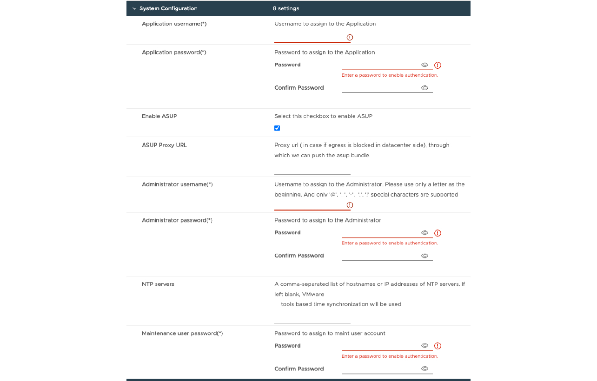

= Implantar a configuração de HA
:allow-uri-read: 
:icons: font
:imagesdir: ../media/

[role="lead"]
Você pode configurar três nós de HA em configurações pequenas, médias ou grandes. A implantação DE HA usa o Trident para armazenar os dados dos serviços.

* Três nós de HA pequenos contêm 8 CPUs e 16 GB de RAM por nó.
* Três nós de HA média contêm 12 CPUs e 24 GB de RAM por nó.
* Os três nós de HA grandes contêm 16 CPUs e 32 GB de RAM por nó.

*Antes de começar*

Esta tarefa fornece instruções sobre como instalar três nós de HA em configurações pequenas, médias ou altas.

NOTE: Criar a biblioteca de conteúdo é uma etapa obrigatória para implantar a configuração de três nós de HA. link:../deploy/download-ontap-tools.html["Faça o download das ferramentas do ONTAP"]Consulte para obter detalhes. Saiba mais https://blogs.vmware.com/vsphere/2020/01/creating-and-using-content-library.html["Criando e usando a Biblioteca de conteúdo"].

Certifique-se de ter importado seu OVA para sua biblioteca de conteúdo. Mantenha o nome da biblioteca de conteúdo e o nome do item da biblioteca que você deu ao ITEM OVA à mão.

NOTE: Antes de prosseguir com a implantação, defina o DRS (Distributed Resource Scheduler) do cluster no inventário como 'Conservador' durante a instalação de ferramentas do ONTAP. Isso garante que as VMs não migrem durante a instalação.

*Passos*

. Para implantar a partir do servidor vSphere:
+
.. Faça login no servidor vSphere.
.. Navegue até o pool de recursos ou o host onde você deseja implantar o OVA e clique com o botão direito do Mouse no local desejado onde você deseja implantar a VM e selecione *Deploy OVF template...*
+

NOTE: Não implante ferramentas do ONTAP a máquina virtual VMware vSphere em um datastore vVols que ele gerencia.

.. Você pode inserir o URL do arquivo _.ova_ ou navegar para a pasta onde o arquivo _.ova_ é salvo e, em seguida, selecionar *Next*

. Para implantar a partir da biblioteca de conteúdo:
+
.. Vá para sua biblioteca de conteúdo e clique no item da biblioteca que você deseja implantar.
.. Clique em *ações* > *Nova VM a partir deste modelo*

. Selecione um nome e uma pasta para a máquina virtual e selecione *Next*.
. Selecione o host e selecione *Next*
. Revise o resumo do modelo e selecione *Next*.
. Leia e aceite o contrato de licença e selecione *Next*.
. Na janela *Configuration*, selecione *High-Availability Deployment(S)*, *High-Availability Deployment(M)* ou *High-Availability Deployment(L)* configuração, dependendo da sua necessidade.
. Selecione o armazenamento para os arquivos de configuração e disco, selecione *Next*.
. Selecione a rede de destino para cada rede de origem, selecione *seguinte*.
. Selecione a janela *Personalizar modelo* > *Configuração do sistema*.
+

+
Introduza os seguintes detalhes:

+
.. Nome de usuário e senha do aplicativo: Esse nome de usuário e senha são usados para Registrar tanto o provedor VASA quanto o SRA no vCenter Server.
.. A caixa de verificação *Enable AutoSupport* está selecionada por predefinição. O AutoSupport só pode ser ativado ou desativado durante a implantação.
.. No campo *URL de proxy ASUP*, forneça esse URL para evitar o bloqueio do firewall para a transmissão de dados do AutoSupport.
.. Nome de usuário do administrador e senha do administrador: Essa é a senha usada para fazer login no Gerenciador de ferramentas do ONTAP.
.. Introduza as informações do servidor NTP no campo *servidores NTP*.
.. Senha do usuário de manutenção: Ela é usada para conceder acesso a "Opções do console de manutenção".

. Na janela *Personalizar modelo* > *Configuração de implantação*, digite os seguintes detalhes:
+
image:../media/ha-deploy-config.png["Configuração de implantação"]

+
.. Insira um endereço IP disponível no endereço IP virtual para o plano de controle do Kubernetes. Você precisa disso para o servidor de API do Kubernetes.
.. Na opção de implantação avançada, selecione a opção *Enable SVM Scoping* quando você pretende usar a conta de usuário SVM diretamente adicionada. Para usar o cluster ONTAP, não marque a caixa de seleção.
+

NOTE: Quando o escopo da SVM estiver ativado, você já deverá ter o suporte à SVM com endereço IP de gerenciamento.

.. Selecione NFS ou iSCSI no campo *Protocol*.
.. Insira o cluster do ONTAP ou o endereço IP de gerenciamento do SVM no campo *ONTAP/SVM Management LIF*.
.. Digite o cluster do ONTAP ou o SVM ONTAP/SVM Data LIF. O LIF de dados deve pertencer ao protocolo selecionado. Por exemplo, se o protocolo iSCSI for selecionado, deverá ser fornecido um LIF de dados iSCSI.
.. Para a VM de storage, você pode optar por fornecer os detalhes da VM de storage padrão do ONTAP ou criar uma nova VM de storage. Não insira o valor no campo *Storage VM* quando a opção Enable SVM Scoping for selecionada, pois esse campo é ignorado.
.. Insira o nome de usuário do ONTAP/SVM. O nome de usuário e a senha do ONTAP/SVM são necessários para que o Trident crie volumes para armazenar os dados de serviços em caso de implantação avançada ou de HA e para recuperar os dados de volumes durante falha de nó.
.. Digite a senha ONTAP/SVM.
.. A VM principal está ativada por predefinição. Não altere esta escolha.

. Na janela *Personalizar modelo* > *Detalhes da Biblioteca de conteúdo*, digite *Nome da Biblioteca de conteúdo* e *Nome do modelo OVF*.
. Na janela *Customize template* > *vCenter Configuration*, forneça os detalhes do vCenter Server onde a biblioteca de conteúdo está hospedada.
. Na janela *Customize template* > *Node Configuration* (Personalizar modelo*), insira as propriedades de rede DO OVA para todos os três nós.
+

NOTE: As informações fornecidas aqui serão validadas para padrões adequados durante o processo de instalação. Em caso de discrepância, uma mensagem de erro será exibida no console da Web e você será solicitado a corrigir qualquer informação incorreta fornecida.

+
.. Insira o nome do host. Nomes de host que consistem em letras maiúsculas (A-Z), letras minúsculas (a-z), dígitos (0-9) e carateres especiais (-) são suportados apenas. Se você quiser configurar a pilha dupla, especifique o nome do host mapeado para o endereço IPv6.
.. Introduza o endereço IP (IPv4) mapeado para o nome do anfitrião. No caso de pilha dupla, forneça qualquer endereço IP IPv4 disponível que esteja na mesma VLAN que o endereço IPv6.
.. Insira o ENDEREÇO IPv6 na rede implantada somente quando você precisar de pilha dupla.
.. Especifique o comprimento do prefixo apenas para IPv6.
.. Especifique a sub-rede a ser usada na rede implantada no campo Máscara de rede (somente para IPv4).
.. Especifique o Gateway na rede implantada.
.. Especifique o endereço IP do servidor DNS primário.
.. Especifique o endereço IP do servidor DNS secundário.
.. Especifique o nome do domínio de pesquisa a ser usado ao resolver o nome do host.
.. Especifique o gateway IPv6 na rede implantada somente quando você precisar de pilha dupla.

. Na janela *Customize template* > *Node 2 Configuration* e *Node 3 Configuration*, digite os seguintes detalhes:
+
.. Nome do host 2 e 3 - nomes de host que consistem em letras maiúsculas (A-Z), letras minúsculas (a-z), dígitos (0-9) e carateres especiais (-) são suportados apenas. Se você quiser configurar a pilha dupla, especifique o nome do host mapeado para o endereço IPv6.
.. Endereço IP
.. Endereço IPV6

. Revise os detalhes na janela *Pronto para concluir*, selecione *concluir*.
+
À medida que a tarefa de implantação é criada, o progresso é mostrado na barra de tarefas do vSphere.

. Ligue a VM após a conclusão da tarefa.
+
A instalação começa. Você pode acompanhar o progresso da instalação no console da Web da VM. Como parte da instalação, as configurações dos nós são validadas. As entradas fornecidas sob diferentes seções sob o modelo Personalizar no formulário OVF são validadas. No caso de discrepâncias, uma caixa de diálogo solicita que você tome medidas corretivas.

. Faça as alterações necessárias no prompt de diálogo. Use o botão Tab para navegar pelo painel para inserir seus valores, *OK* ou *Cancelar*.
. Ao selecionar *OK*, os valores fornecidos serão novamente validados. As Ferramentas do ONTAP para VMware permitem três tentativas de corrigir quaisquer valores inválidos. Se você não conseguir corrigir problemas após três tentativas, a instalação do produto será interrompida e você será aconselhado a tentar a instalação em uma nova VM.
. Após a instalação bem-sucedida, o console da Web mostra o estado das ferramentas do ONTAP para o VMware vSphere.

