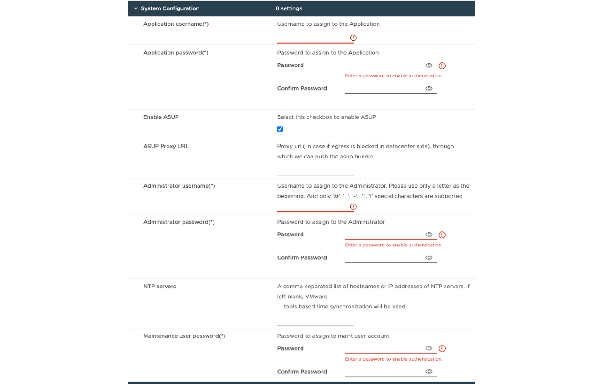

= Implante uma configuração de nó único que não seja de HA
:allow-uri-read: 
:icons: font
:imagesdir: ../media/

[role="lead"]
Você pode implantar uma configuração de nó único que não seja HA em uma configuração pequena ou média.

* A pequena configuração não-HA contém 8 CPUs e 16 GB de RAM.
* A configuração média não-HA contém 12 CPUs e 24 GB de RAM.

*Antes de começar*

Certifique-se de que a rota de rede está presente. A rede de dados de armazenamento precisa ser acessível a partir da rede de gerenciamento de VM. Exemplo: C1_sti67-vsim-ucs154k_1679633108::> rota de rede criar -vserver <SVM> -destino 0,0.0.0/0 -gateway <gateway_ip>

*Passos*

. Faça login no servidor vSphere.
. Navegue até o pool de recursos ou o cluster ou o host onde você deseja implantar o OVA.
. Clique com o botão direito do rato no local pretendido e selecione *Deploy OVF template...*.
+

NOTE: Não implante ferramentas do ONTAP a máquina virtual VMware vSphere em um datastore vVols que ele gerencia.

. Você pode inserir o URL do arquivo _.ova_ ou navegar para a pasta onde o arquivo _.ova_ é salvo e, em seguida, selecionar *Next*.
. Selecione um nome e uma pasta para a máquina virtual e selecione *Next*.
. Selecione o host e selecione *Next*
. Revise o resumo do modelo e selecione *Next*.
. Leia e aceite o contrato de licença e selecione *Next*.
. Na janela *Configuration*, selecione *Easy Deployment(S)*, *Easy Deployment(M)* ou *Advanced Deployment(S)* ou *Advanced Deployment(M)* Configuration.
+
As opções avançadas de implantação usam o Trident como um provisionador de storage dinâmico para o ONTAP para criar volumes e a implantação fácil usa o storage local para criar volumes.

. Selecione o datastore onde você precisa implantar o OVA e selecione *Next*.
. Selecione a rede de origem e destino e selecione *Next*.
. Selecione a janela *Personalizar modelo* > *Configuração do sistema*.
+
 Digite os seguintes detalhes: .. Nome de usuário e senha do aplicativo: Esse nome de usuário e senha são usados para Registrar tanto o provedor VASA quanto o SRA no vCenter Server. .. A caixa de verificação *Enable ASUP* (Ativar ASUP) está selecionada por predefinição.

O AutoSupport só pode ser ativado ou desativado durante a implantação. .. No campo *URL de proxy ASUP*, forneça esse URL para evitar o bloqueio do firewall para a transmissão de dados do AutoSupport. .. Nome de usuário do administrador e senha do administrador: Essa é a senha usada para fazer login no Gerenciador de Ferramentas do ONTAP. .. Introduza as informações do servidor NTP no campo *servidores NTP*. .. Senha do usuário de manutenção: Ela é usada para conceder acesso a "Opções do console de manutenção". . Na janela *Personalizar modelo* > *Configuração de implantação*, digite os seguintes detalhes:

E image:../media/ha-deploy-config.png["Configuração de implantação"]

. Insira um endereço IP disponível no endereço IP virtual para o plano de controle do Kubernetes. Você precisa disso para o servidor de API do Kubernetes.
. Selecione a opção *Enable SVM Scoping* quando pretender utilizar a conta de utilizador SVM diretamente adicionada. Para usar o cluster ONTAP, não marque a caixa de seleção.
+

NOTE: Quando o escopo da SVM estiver ativado, você já deverá ter habilitado o suporte à SVM com endereço IP de gerenciamento.

. Selecione NFS ou iSCSI no campo *Protocol*.
. Insira o cluster do ONTAP ou o endereço IP de gerenciamento do SVM no campo *ONTAP/SVM Management LIF*.
. Digite o cluster do ONTAP ou o SVM ONTAP/SVM Data LIF. O LIF de dados deve pertencer ao protocolo selecionado. Por exemplo, se o protocolo iSCSI for selecionado, deverá ser fornecido um LIF de dados iSCSI.
. Para a VM de storage, você pode optar por fornecer os detalhes da VM de storage padrão do ONTAP ou criar uma nova VM de storage. Não insira o valor no campo *Storage VM* quando a opção Enable SVM Scoping for selecionada, pois esse campo é ignorado.
. Insira o nome de usuário do ONTAP/SVM. O nome de usuário e a senha do ONTAP/SVM são necessários para que o Trident crie volumes para armazenar os dados de serviços em caso de implantação avançada ou de HA e para recuperar os dados de volumes durante falha de nó.
. Digite a senha ONTAP/SVM.
. A VM principal está ativada por predefinição. Não altere esta escolha.
+
.. Na janela *Customize template* > *Node Configuration* (Personalizar modelo*), insira as propriedades de rede DO OVA.
+

NOTE: As informações fornecidas aqui serão validadas para padrões adequados durante o processo de instalação. Em caso de discrepância, uma mensagem de erro será exibida no console da Web e você será solicitado a corrigir qualquer informação incorreta fornecida.

. Introduza o nome do anfitrião. Nomes de host que consistem em letras maiúsculas (A-Z), letras minúsculas (a-z), dígitos (0-9) e carateres especiais (-) são suportados apenas. Se você quiser configurar a pilha dupla, especifique o nome do host mapeado para o endereço IPv6.
. Introduza o endereço IP (IPv4) mapeado para o nome do anfitrião. No caso de pilha dupla, forneça qualquer endereço IP IPv4 disponível que esteja na mesma VLAN que o endereço IPv6.
. Insira o ENDEREÇO IPv6 na rede implantada somente quando você precisar do comando duplo.
. Especifique o comprimento do prefixo apenas para IPv6.
. Especifique a sub-rede a ser usada na rede implantada no campo Máscara de rede (somente para IPv4).
. Especifique o Gateway na rede implantada.
. Especifique o endereço IP do servidor DNS primário.
. Especifique o endereço IP do servidor DNS secundário.
. Especifique o nome do domínio de pesquisa a ser usado ao resolver o nome do host.
. Especifique o gateway IPv6 na rede implantada somente quando você precisar de pilha dupla.
+
.. Revise os detalhes na janela *Pronto para concluir*, selecione *concluir*.
+
À medida que a tarefa de implantação é criada, o progresso é mostrado na barra de tarefas do vSphere.

.. Ligue a VM após a conclusão da tarefa.
+
A instalação começa. Você pode acompanhar o progresso da instalação no console da Web da VM. Como parte da instalação, as configurações dos nós são validadas. As entradas fornecidas sob diferentes seções sob o modelo Personalizar no formulário OVF são validadas. Em caso de discrepâncias, uma caixa de diálogo solicita que você tome medidas corretivas.

.. Faça as alterações necessárias no prompt de diálogo. Use o botão Tab para navegar pelo painel para inserir seus valores, *OK* ou *Cancelar*.
.. Ao selecionar *OK*, os valores fornecidos serão novamente validados. As Ferramentas do ONTAP para VMware permitem três tentativas de corrigir quaisquer valores inválidos. Se você não conseguir corrigir problemas após três tentativas, a instalação do produto será interrompida e você será aconselhado a tentar a instalação em uma nova VM.
.. Após a instalação bem-sucedida, o console da Web mostra o estado das ferramentas do ONTAP para o VMware vSphere.

